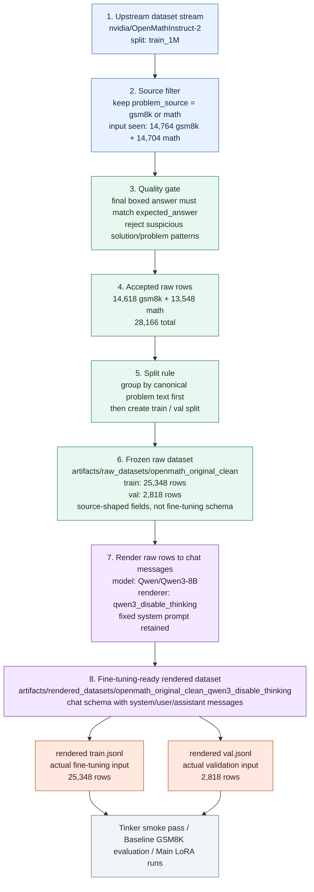

# Artifacts

This directory keeps the retained project outputs that matter for phase one.

The raw and rendered dataset artifacts are derived from third-party datasets.
See [THIRD_PARTY_NOTICES.md](../THIRD_PARTY_NOTICES.md) for attribution, upstream URLs, license labels,
and citation notes.

The full JSONL payloads are stored on Hugging Face:

- Dataset repo: [sumitdotml/lora-and-friends-dataset](https://huggingface.co/datasets/sumitdotml/lora-and-friends-dataset)
- GitHub manifest: [`huggingface_dataset_manifest.json`](huggingface_dataset_manifest.json)

Git keeps the manifests, audit evidence, and scripts. Local checkouts can still keep the JSONL files
under the paths below, but those payload files are ignored so the GitHub repository stays lightweight.

The structure is pipeline-shaped:

1. `raw_datasets/`
2. `rendered_datasets/`
3. `audits/`

## What Each Directory Means

### `raw_datasets/`

`raw_datasets/` holds the **canonical raw selected dataset**.

This is the stage after:

- pulling rows from the upstream source dataset
- applying quality gates
- splitting into train and validation

This is the stage before:

- model-specific chat rendering
- prompt-template decisions
- training-ready formatting

For the current project, the canonical raw dataset is:

- `raw_datasets/openmath_original_clean/`

That directory contains rows in a source-like schema:

```json
{
  "row_id": "...",
  "source": "gsm8k",
  "problem": "...",
  "generated_solution": "...",
  "expected_answer": "..."
}
```

The data here is selected from `nvidia/OpenMathInstruct-2`, but it is still source-shaped data, not renderer-specific training data.

### `rendered_datasets/`

`rendered_datasets/` holds the **training-ready rendered datasets**.

This stage is built from the raw dataset and adds:

- the chosen model family
- the chosen renderer
- the chosen system prompt
- the final chat-message structure

For the current project, the retained training-ready dataset is:

- `rendered_datasets/openmath_original_clean_qwen3_disable_thinking/`

That directory contains rows in the training schema:

```json
{
  "row_id": "...",
  "source": "gsm8k",
  "expected_answer": "...",
  "messages": [
    {"role": "system", "content": "..."},
    {"role": "user", "content": "..."},
    {"role": "assistant", "content": "..."}
  ]
}
```

So the distinction is:

- `raw_datasets/` = what data was accepted
- `rendered_datasets/` = how that accepted data is fed into the model

### `audits/`

`audits/` holds the **evidence trail** for why a raw dataset or rendered dataset was accepted.

This includes:

- heuristic quality reports
- manual review samples
- render sanity checks
- other supporting diagnostics

For the current project, the retained audit folders are:

- `audits/openmath_original_clean_quality_train/`
- `audits/openmath_original_clean_quality_val/`
- `audits/openmath_original_clean_manual_review_100/`
- `audits/openmath_original_clean_render_sanity/`
- `audits/contamination_check/`

## Current Canonical Flow

The current retained pipeline is:



Evidence behind the diagram:

| Diagram claim | Repo evidence |
|---|---|
| Upstream dataset is `nvidia/OpenMathInstruct-2`, split `train_1M` | `scripts/build_openmath_original_clean_raw_dataset.py`, `artifacts/raw_datasets/openmath_original_clean/manifest.json` |
| Only `gsm8k` and `math` sources are retained | `SOURCES = ("gsm8k", "math")` in `scripts/build_openmath_original_clean_raw_dataset.py`; raw manifest `sources` |
| Quality gate uses boxed-answer match plus suspicious pattern filters | `candidate_ok()` in `scripts/build_openmath_original_clean_raw_dataset.py`; raw manifest `reject_reasons` |
| Split is grouped by canonical problem text before train/validation split | `canonical_problem()` and `groups_by_problem` in `scripts/build_openmath_original_clean_raw_dataset.py`; raw manifest `split_rule` |
| Raw dataset row counts are `25,348` train and `2,818` val | raw manifest `split_source_counts`; rendered manifest `splits` |
| Quality audits passed on retained train and val files | `artifacts/audits/openmath_original_clean_quality_train/report.json`; `artifacts/audits/openmath_original_clean_quality_val/report.json` |
| Manual review sample contains `100` retained rows | `artifacts/audits/openmath_original_clean_manual_review_100/manifest.json` |
| GSM8K test overlap and train/val overlap are zero | `artifacts/audits/contamination_check/report.json` |
| Render sanity evidence exists for the fixed system prompt and sample renders | `artifacts/audits/openmath_original_clean_render_sanity/report.json`; `artifacts/audits/openmath_original_clean_render_sanity/sample_renders.txt` |
| Rendered dataset uses `Qwen/Qwen3-8B`, `qwen3_disable_thinking`, and the fixed system prompt | `artifacts/rendered_datasets/openmath_original_clean_qwen3_disable_thinking/manifest.json` |
| Rendered `train.jsonl` and `val.jsonl` are the fine-tuning and validation inputs | `AGENTS.md`; `TODO.md` locked context |
| Tinker smoke/SFT run is a next planned consumer, not completed evidence | `TODO.md` marks the thin Tinker smoke pass as `not started` |

Editable presentation version:

- `dataset_lineage.excalidraw`

## Which Files Matter Most

If only the core artifacts matter, start with:

- `raw_datasets/openmath_original_clean/manifest.json`
- `rendered_datasets/openmath_original_clean_qwen3_disable_thinking/manifest.json`
- `huggingface_dataset_manifest.json`
- Hugging Face `raw/openmath_original_clean/train.jsonl`
- Hugging Face `raw/openmath_original_clean/val.jsonl`
- Hugging Face `rendered/openmath_original_clean_qwen3_disable_thinking/train.jsonl`
- Hugging Face `rendered/openmath_original_clean_qwen3_disable_thinking/val.jsonl`

If the goal is to understand why this recipe was trusted, read these files:

- `audits/openmath_original_clean_quality_train/report.json`
- `audits/openmath_original_clean_quality_val/report.json`
- `audits/openmath_original_clean_manual_review_100/sample.jsonl`
- `audits/openmath_original_clean_render_sanity/report.json`
- `audits/contamination_check/report.json`

## Retired Branch

The old augmented `openmath_30k*` branch was removed during cleanup.

If future work reopens dataset curation, better to create a new explicit lineage instead of reusing the retired names.
